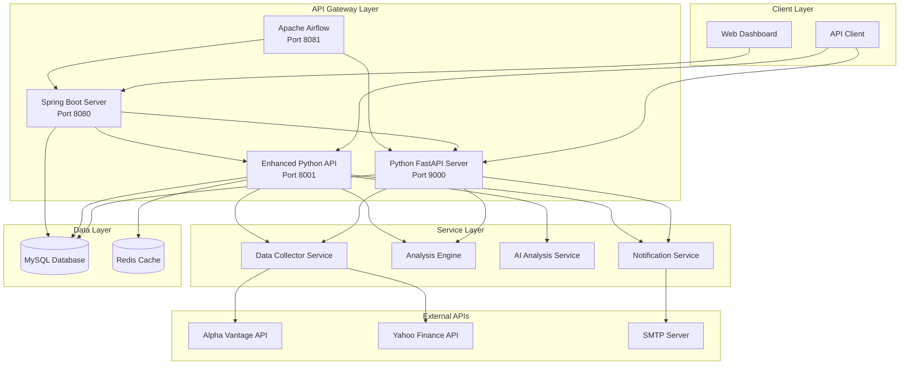

<br/>

# 실시간 주식 데이터 분석 및 알림 시스템

[](https://python.org)
[](https://spring.io/projects/spring-boot)
[](https://fastapi.tiangolo.com)
[](https://opensource.org/licenses/Apache-2.0)

## 프로젝트 개요

**Stock Analysis System**은 실시간 주식 데이터 수집, 고급 기술적 분석, AI 기반 인사이트 생성, 그리고 종합적인 알림 시스템을 제공하는 마이크로서비스 기반의 종합 투자 플랫폼입니다.

## 화면 
<br/>
<br/>


### 핵심 특징

- **실시간 데이터 처리**: Yahoo Finance, Alpha Vantage API를 통한 실시간 주가 데이터 수집
- **고급 기술적 분석**: RSI, MACD, 볼린저 밴드 등 20+ 기술적 지표 계산
- **AI 기반 분석**: 머신러닝을 활용한 이상 패턴 감지 및 투자 인사이트 생성
- **마이크로서비스 아키텍처**: Python FastAPI + Spring Boot 기반 확장 가능한 구조
- **실시간 대시보드**: WebSocket을 통한 실시간 차트 및 분석 결과 시각화
- **이메일 알림 시스템**: AI 기반 이메일 템플릿을 통한 개인화된 알림

## 시스템 아키텍처



## 주요 기능

### 1. 실시간 데이터 수집

- **다중 API 지원**: Yahoo Finance, Alpha Vantage API
- **성능 최적화**: 비동기 처리, 캐싱, Rate Limiting
- **데이터 품질 관리**: 자동 검증 및 품질 점수 계산
- **Fallback 메커니즘**: API 장애 시 자동 대체 수집

### 2. 고급 기술적 분석

- **기본 지표**: RSI, MACD, 볼린저 밴드, 이동평균선
- **고급 지표**: ADX, Stochastic, Williams %R, MFI
- **패턴 인식**: 차트 패턴 자동 감지
- **지지/저항선**: 자동 계산 및 분석
- **피보나치 레벨**: 자동 피보나치 되돌림 분석

### 3. AI 기반 분석

- **이상 패턴 감지**: Isolation Forest, K-Means 클러스터링
- **시장 상황 분석**: 트렌드 강도, 시장 체제 분석
- **투자 신호 생성**: AI 기반 매수/매도/보유 신호
- **신뢰도 점수**: 분석 결과의 신뢰도 정량화

### 4. 실시간 대시보드

- **인터랙티브 차트**: Chart.js 기반 실시간 차트
- **WebSocket 통신**: 실시간 데이터 스트리밍
- **반응형 디자인**: 모바일/데스크톱 최적화
- **다국어 지원**: 한국어/영어 지원

### 5. 이메일 구독 및 알림 시스템

- **이메일 구독**: 사용자가 이메일 구독 신청 및 관리
- **개인화 알림**: 사용자별 알림 조건 및 템플릿 설정
- **AI 템플릿**: 동적 이메일 템플릿 생성 및 변수 치환
- **자동 발송**: Airflow DAG를 통한 일일 리포트 자동 발송
- **관리자 대시보드**: 구독자 관리 및 통계 확인
- **개인정보 보호**: 이메일/전화번호 마스킹 처리
- **발송 이력 관리**: 이메일 발송 로그 및 통계 확인

### 6. 보안 및 모니터링

- **JWT 인증**: 토큰 기반 인증 시스템 (Spring Boot, Enhanced API)
- **Rate Limiting**: API 호출 제한 및 IP 차단
- **Circuit Breaker**: 장애 격리 및 복구
- **보안 관리**: 비밀번호 암호화, XSS/SQL Injection 방어
- **세션 관리**: 세션 타임아웃 및 IP 검증
- **로깅 시스템**: 종합적인 로그 관리 및 오류 추적

## 폴더 구조

```
StockAnalysisSystem/
├── data_collectors/          # 데이터 수집 모듈
│   ├── stock_data_collector.py
│   └── performance_optimized_collector.py
├── analysis_engine/          # 분석 엔진
│   ├── technical_analyzer.py
│   └── advanced_analyzer.py
├── webbackend/              # Spring Boot 백엔드
│   ├── src/main/kotlin/com/sleekydz86/backend/
│   │   ├── application/        # 애플리케이션 계층
│   │   │   ├── controller/      # REST 컨트롤러
│   │   │   ├── service/         # 비즈니스 서비스
│   │   │   └── config/          # 설정 클래스
│   │   ├── domain/            # 도메인 계층
│   │   │   ├── model/          # 도메인 모델
│   │   │   ├── service/        # 도메인 서비스
│   │   │   └── repository/     # 리포지토리 인터페이스
│   │   └── infrastructure/     # 인프라 계층
│   │       ├── client/         # 외부 API 클라이언트
│   │       ├── repository/     # 리포지토리 구현
│   │       └── security/       # 보안 설정
│   └── src/main/resources/static/
│       ├── index.html          # 메인 대시보드
│       ├── email-subscription.html  # 이메일 구독 페이지
│       ├── admin-dashboard.html     # 관리자 대시보드
│       └── admin-login.html         # 관리자 로그인
├── airflow_dags/           # Airflow DAG들
│   ├── stock_analysis_dag.py
│   └── email_notification_dag.py
├── notification/           # 알림 서비스
│   └── notification_service.py
├── database/               # DB 스키마
│   ├── schema.sql
│   └── sample_notification_settings.sql
├── config/                 # 설정 파일
│   └── settings.py
├── security/              # 보안 모듈
│   └── security_manager.py
├── error_handling/         # 오류 처리
│   └── error_manager.py
├── tests/                  # 테스트 코드
│   ├── test_api_server.py
│   ├── test_technical_analyzer.py
│   ├── test_notification_service.py
│   └── test_advanced_analyzer.py
├── docs/                   # 문서
│   ├── SYSTEM_ARCHITECTURE.md
│   ├── API_DOCUMENTATION.md
│   ├── INTEGRATION_GUIDE.md
│   └── adr/                # 아키텍처 결정 기록
├── api_server.py           # Python FastAPI 서버 (Port 9000)
├── api_server_enhanced.py  # 향상된 Python API 서버 (Port 8001)
├── main.py                 # 메인 실행 파일
├── start_python_api.py     # Python API 서버 실행 스크립트
├── requirements.txt        # Python 의존성
├── start_spring_boot.sh    # Spring Boot 실행 스크립트 (Linux/Mac)
├── start_spring_boot.bat   # Spring Boot 실행 스크립트 (Windows)
├── check_python_api.py     # Python API 상태 확인
├── check_email_*.py        # 이메일 발송 디버깅 도구
├── test_airflow_connection.py  # Airflow 연결 테스트
├── env_example.txt         # 환경 변수 예제
└── docker-compose.airflow.yml  # Airflow Docker Compose 설정
```

## 빠른 시작

### 1. 환경 설정

```bash
# 저장소 클론
git clone https://github.com/skyleedevzero86/StockAnalysisSystem.git
cd StockAnalysisSystem

# Python 가상환경 생성
python -m venv venv
source venv/bin/activate  # Windows: venv\Scripts\activate

# Python 의존성 설치
pip install -r requirements.txt
```

### 2. 데이터베이스 설정

```bash
# MySQL 데이터베이스 생성
mysql -u root -p < database/schema.sql

# 환경 변수 설정
cp env_example.txt .env
# .env 파일에서 실제 값들 설정
```

### 3. 서버 실행

#### Spring Boot 서버 (터미널 1)

```bash
# Linux/Mac
chmod +x start_spring_boot.sh
./start_spring_boot.sh

# Windows
start_spring_boot.bat

# 또는 webbackend 디렉토리에서 직접 실행
cd webbackend
./gradlew bootRun
```

#### Python API 서버 (터미널 2)

```bash
# 기본 API 서버 (Port 9000)
python start_python_api.py
# 또는
python api_server.py

# 향상된 API 서버 (Port 8001)
python api_server_enhanced.py
```

# 또는 로컬에서 직접 실행

airflow webserver --port 8081
airflow scheduler

```

> **참고**: 실행 순서는 Spring Boot → Python API → Airflow 순서입니다. 자세한 내용은 [AIRFLOW_DOCKER_SETUP.md](AIRFLOW_DOCKER_SETUP.md)를 참조하세요.

### 4. 대시보드 접속

#### 웹 인터페이스 (Spring Boot - Port 8080)

- **메인 대시보드**: http://localhost:8080
- **이메일 구독**: http://localhost:8080/email-subscription.html
- **관리자 로그인**: http://localhost:8080/admin-login.html
- **관리자 대시보드**: http://localhost:8080/admin-dashboard.html
- **API 테스트**: http://localhost:8080/api-view.html
- **템플릿 관리**: http://localhost:8080/template-management.html
- **이메일 발송 이력**: http://localhost:8080/email-history.html

#### API 문서

- **Python API (기본)**: http://localhost:9000/docs
- **Python API (향상된)**: http://localhost:8001/docs

#### Airflow UI

- **Airflow 대시보드**: http://localhost:8081 (기본 계정: airflow/airflow)

## 기술 스택

### Backend

- **Python 3.8+**: FastAPI, pandas, numpy, scikit-learn
- **Spring Boot 3.2.0**: Kotlin, WebFlux, WebSocket
- **Database**: MySQL 8.0, Redis
- **Message Queue**: Apache Airflow

### Frontend

- **HTML5/CSS3/JavaScript**: 반응형 웹 디자인
- **Chart.js**: 실시간 차트 시각화
- **Axios**: HTTP 클라이언트
- **WebSocket API**: 실시간 통신

### DevOps & Monitoring

- **Apache Airflow**: 워크플로우 자동화
- **Docker**: 컨테이너화 (Airflow Docker Compose 포함)
- **로깅 시스템**: 종합적인 로그 관리 및 오류 추적
- **디버깅 도구**: 시스템 상태 확인 및 진단 스크립트


## 성능 지표

- **데이터 수집**: 8개 종목 동시 처리 (평균 2초)
- **분석 처리**: 50일 데이터 기준 평균 0.5초
- **API 응답**: 평균 200ms 이하 (향상된 API는 캐싱으로 더 빠름)
- **WebSocket**: 실시간 업데이트 (5초 간격)
- **캐시 히트율**: 80% 이상 (향상된 API)
- **동시 연결**: 최대 100개 WebSocket 연결 지원
- **Airflow DAG 실행**: 자동 이메일 발송

## 주요 페이지

### 웹 인터페이스 (Spring Boot - Port 8080)

- **메인 대시보드** (`/index.html`): 실시간 주식 분석 차트
- **이메일 구독** (`/email-subscription.html`): 사용자 구독 신청 페이지
- **관리자 로그인** (`/admin-login.html`): 관리자 인증 페이지
- **관리자 대시보드** (`/admin-dashboard.html`): 구독자 관리 및 통계
- **API 테스트** (`/api-view.html`): API 엔드포인트 테스트 도구
- **템플릿 관리** (`/template-management.html`): AI 기반 이메일 템플릿 관리
- **이메일 발송 이력** (`/email-history.html`): 이메일 발송 로그 및 통계

### 추가 문서

- **[AIRFLOW_DOCKER_SETUP.md](AIRFLOW_DOCKER_SETUP.md)**: Airflow Docker 설정 가이드
- **[AI_TEMPLATE_GUIDE.md](AI_TEMPLATE_GUIDE.md)**: AI 분석 템플릿 시스템 가이드
- **[docs/API_DOCUMENTATION.md](docs/API_DOCUMENTATION.md)**: 전체 API 문서
- **[docs/SYSTEM_ARCHITECTURE.md](docs/SYSTEM_ARCHITECTURE.md)**: 시스템 아키텍처 상세 설명
- **[docs/INTEGRATION_GUIDE.md](docs/INTEGRATION_GUIDE.md)**: 통합 가이드
- **[docs/TESTING_GUIDE.md](docs/TESTING_GUIDE.md)**: 테스트 가이드
- **[docs/TECHNICAL_INDICATORS_GUIDE.md](docs/TECHNICAL_INDICATORS_GUIDE.md)**: 기술적 지표 가이드
- **[docs/adr/](docs/adr/)**: 아키텍처 결정 기록 (ADR)

## 기여하기

1. Fork the Project
2. Create your Feature Branch (`git checkout -b feature/AmazingFeature`)
3. Commit your Changes (`git commit -m 'Add some AmazingFeature'`)
4. Push to the Branch (`git push origin feature/AmazingFeature`)
5. Open a Pull Request

## 라이선스

이 프로젝트는 Apache 2.0 라이선스 하에 배포됩니다. 자세한 내용은 [LICENSE](LICENSE) 파일을 참조하세요.

## 연락처

- **프로젝트 링크**: [https://github.com/skyleedevzero86/StockAnalysisSystem](https://github.com/skyleedevzero86/StockAnalysisSystem)
- **이슈 리포트**: [Issues](https://github.com/skyleedevzero86/StockAnalysisSystem/issues)

## 감사의 말

- [Yahoo Finance](https://finance.yahoo.com/) - 실시간 주가 데이터 제공
- [Alpha Vantage](https://www.alphavantage.co/) - 금융 데이터 API
- [FastAPI](https://fastapi.tiangolo.com/) - 고성능 Python 웹 프레임워크
- [Spring Boot](https://spring.io/projects/spring-boot) - 엔터프라이즈 Java 프레임워크

---
```
